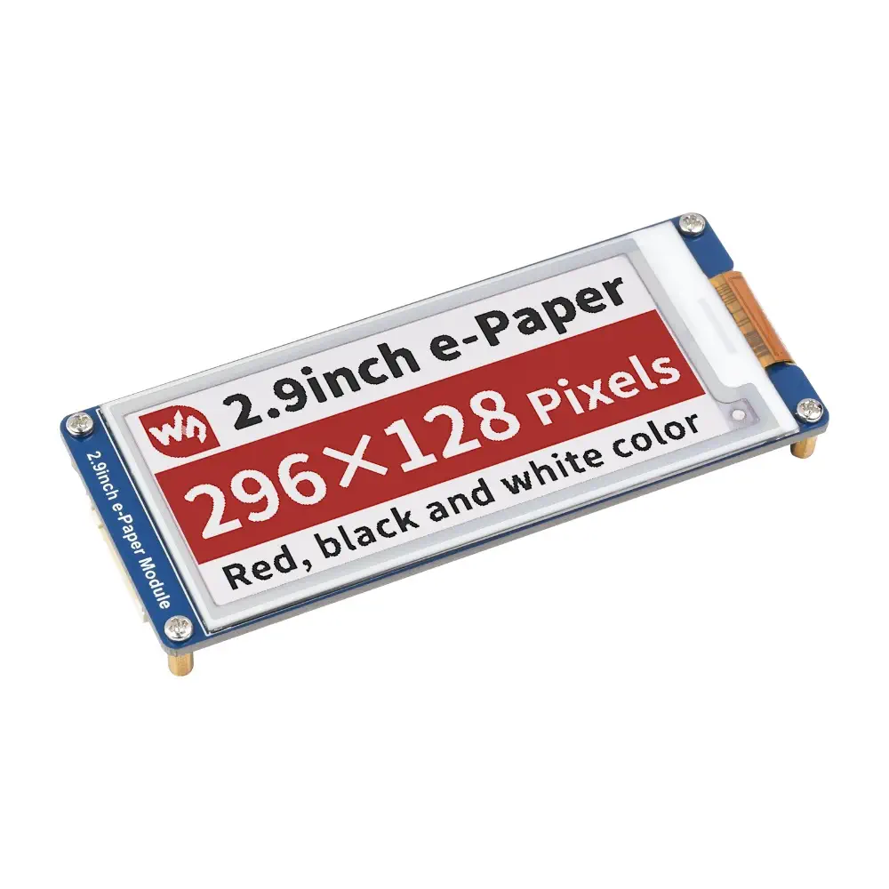
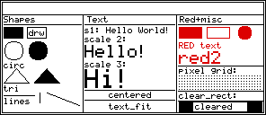

# MicroPython Driver for Waveshare 2.9" e-Paper B V3 (Black/White/Red)

A fast, feature-rich MicroPython driver for the **Waveshare 2.9inch e-Paper B V3** display (128×296 pixels, black/white/red).  
Optimised for ESP32-S3 Zero, but works on any MicroPython board with SPI.



## Features

* Full black, white and red support via two independent framebuffers
* Software rotation: 0°, 90°, 180°, 270°
* Drawing primitives: pixel, lines, rectangles, circles, triangles
* `clear_rect` — erase a rectangular area to white
* Built-in 5×7 bitmap font (ASCII 32–122 + degree symbol °)
* Text scaling, centering, and auto-fit to display width
* Low-power deep sleep mode
* BMP screenshot utility (`screenshot.py`)

## Files

|**File**|**Description**|
|:-:|:-:|
|`epaper2in9bv3.py`|Main driver|
|`screenshot.py`|Saves a BMP screenshot from the framebuffer|
|`test_disp.py`|Visual test — all driver features on one landscape screen


## Wiring

| **Display Pin** | **ESP32-S3 Zero** | **GPIO** |
| :-: | :-: | :-: |
| BUSY | GPIO11 | 11 |
| RST | GPIO5 | 5 |
| D/C | GPIO12 | 12 |
| CS | GPIO13 | 13 |
| CLK | GPIO4 | 4 |
| MOSI | GPIO3 | 3 |
| (MISO) | not connected | – |
> **Note:** MISO is not used by the display but is required by MicroPython `SoftSPI` (assign any free pin, default 16).


## Installation

Copy `epaper2in9bv3.py` to the root of your device filesystem using Thonny or `mpremote`.

```
/lib/epaper2in9bv3.py
```

## Basic Usage

```
from epaper2in9bv3 import EPaper29BV3  
ep = EPaper29BV3()  
ep.init()  
ep.clear()  
ep.text(ep.BK, "Hello World!", 10, 20, scale=2)  
ep.fill_rect(ep.RD, 10, 50, 100, 30)  
ep.show()  
ep.sleep()
```


## Constructor

```
`EPaper29BV3(cs=13, dc=12, rst=5, busy=11, clk=4, mosi=3, miso=16, rotation=0)`
```

|**Parameter**|**Default**|**Description**|
|:-:|:-:|:-:|
|`cs`|13|Chip Select pin|
|`dc`|12|Data / Command pin|
|`rst`|5|Reset pin|
|`busy`|11|Busy pin|
|`clk`|4|SPI clock pin|
|`mosi`|3|SPI data pin|
|`miso`|16|SPI MISO (unused by display, required by SoftSPI)|
|`rotation`|0|Display rotation: `0`, `90`, `180`, `270`|


## Example: Drawing

```
ep.clear()  
ep.circle(ep.BK, 64, 80, 30)  
ep.fill_rect(ep.RD, 20, 140, 80, 40)  
ep.text_center(ep.BK, "Demo", 10, scale=2)  
ep.show()
```

## Constants

### Colors

|**Constant**|**Meaning**|
|:-:|:-:|
|`ep.WHITE`|White (background)|
|`ep.BLACK`|Black|
|`ep.RED`|Red|

### Channels

Pass the channel constant as the first argument to every drawing method.

|**Constant**|**Meaning**|
|:-:|:-:|
|`ep.BK`|Black channel framebuffer|
|`ep.RD`|Red channel framebuffer|


## Properties

```
`ep.width   # logical width  (128 for portrait, 296 for landscape)`
`ep.height  # logical height (296 for portrait, 128 for landscape)`
```
Always use `ep.width` / `ep.height` instead of the fixed `W` / `H` constants so code works at any rotation.


## API Reference

### Display control

```
`ep.init()           # initialize — call once after power-on`
`ep.show()           # send both framebuffers and trigger full refresh (\~2-3 s)`
`ep.sleep()          # deep sleep — call before cutting power`
`ep.clear()          # reset both framebuffers to white (no screen refresh)`
`ep.fill(color)      # fill entire framebuffer: WHITE, BLACK, or RED`
```

### Pixel

```
`ep.pixel(channel, x, y)         # set pixel on (black or red)`
`ep.pixel\\\_off(channel, x, y)  # set pixel off (white)`
```

### Lines

```
`ep.hline(channel, x, y, length)      # horizontal line`
`ep.vline(channel, x, y, length)      # vertical line`
`ep.line(channel, x0, y0, x1, y1)     # line between two points (Bresenham)`
```

### Rectangles

```
`ep.fill_rect(channel, x, y, w, h)    # filled rectangle`
`ep.draw_rect(channel, x, y, w, h)    # outline rectangle`
`ep.clear_rect(channel, x, y, w, h)   # erase rectangle to white`
```

### Circle

```
`ep.circle(channel, x0, y0, r)                # outline`
`ep.circle(channel, x0, y0, r, filled=True)   # filled disk`
```

### Triangle

```
`ep.triangle(channel, x0, y0, x1, y1, x2, y2)              # outline`
`ep.triangle(channel, x0, y0, x1, y1, x2, y2, filled=True) # filled`
```

### Text

The built-in font covers ASCII 32–122 (space, digits, upper/lower case letters, common punctuation) plus the degree symbol `°`.  
Character size at `scale=1` is **5×7 pixels**. Each scale step multiplies both dimensions.

|**scale**|**Character size**|**Typical use**|
|:-:|:-:|:-:|
|1|5 × 7 px|Small labels, data|
|2|10 × 14 px|Normal readable text|
|3|15 × 21 px|Large headings|

```
`ep.text(channel, txt, x, y, scale=1)        # render string at (x, y)`
`ep.char(channel, x, y, ch, scale=1)         # render single character, returns next x`
`ep.text\\\_width(txt, scale=1)                 # pixel width of string`
`ep.text\\\_center(channel, txt, y, scale=1)    # render string horizontally centered`
`ep.text\\\_fit(channel, txt, y, max\\\_scale=3)   # render at largest scale that fits width`
```


## Rotation

```
`ep = EPaper29BV3(rotation=0)    # portrait  128×296  (default)`
`ep = EPaper29BV3(rotation=180)  # portrait  128×296  upside-down`
`ep = EPaper29BV3(rotation=90)   # landscape 296×128`
`ep = EPaper29BV3(rotation=270)  # landscape 296×128  mirrored`
```

Rotation can also be changed at runtime:

```
`ep.rotation = 90`
```

### Pixel transform table

|**rotation**|**physical x**|**physical y**|
|:-:|:-:|:-:|
|0|`W - 1 - x`|`H - 1 - y`|
|90|`y`|`H - 1 - x`|
|180|`x`|`y`|
|270|`W - 1 - y`|`x`|

Where `x`, `y` are logical coordinates, `W = 128`, `H = 296`.


## Custom Pins

```
ep = EPaper29BV3(cs=5,dc=17,rst=16,busy=4,clk=18,mosi=23)
```

## Screenshot Utility

`screenshot.py` saves the current framebuffer as a 24-bit BMP file.  
The output image respects the current rotation — a landscape display produces a landscape BMP.

```
`import screenshot`

`screenshot.capture(ep)                  # saves screenshot.bmp`
`screenshot.capture(ep, "my_image.bmp") # custom filename`
```

## Tets Utility

`test_dispt.py` draws test na primitives on display to test its funcionality.



## Memory Usage

- Resolution: 128 × 296 pixels
- Framebuffer per channel: 4736 bytes
- Total RAM usage: ~9.5 KB

## Important Notes

- Full refresh takes ~2–3 seconds (normal for ePaper)
- Always call `sleep()` before cutting power
- No partial refresh support (full refresh only)
- Framebuffer uses inverted logic:
  - `0 = pixel ON (black/red)`
  - `1 = pixel OFF (white)`

## Compatibility

Tested on:

- ESP32-S3 Zero

Should work on:
- ESP32
- RP2040 (Raspberry Pi Pico)
- ESP8266 (limited RAM)

## Documentation

Full API specification available in SPEC.md

## License

MIT – free for personal and commercial use.

